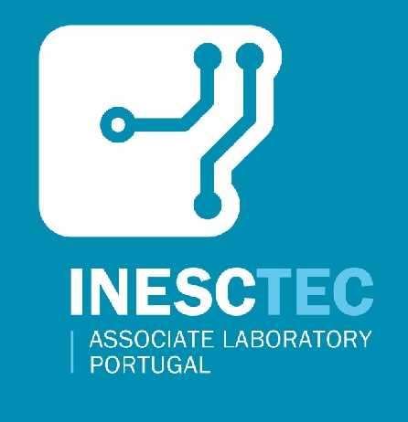
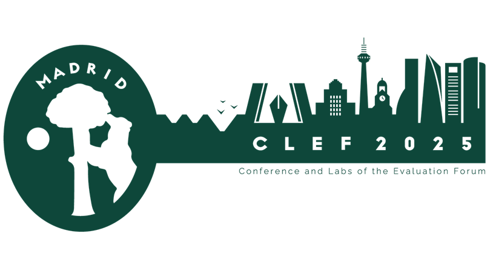

# JOKER

  



 
  <h1 align="center">CLEF 2025 JOKER Track:</h1>
  <h2 align="center">Automatic Humour Analysis</h2> 

## Abstract
  
  Over the last three years, the JOKER Lab series at CLEF has gathered an active community of researchers in natural language processing and information retrieval to collaborate on non-literal use of language in text. Such language can be a challenge for AI systems, but also sometimes for humans, as it requires understanding implicit cultural references and unorthodox interactions between form and meaning.  

## Introduction
    
  Humour plays a vital role in social interaction. Understanding it, however, can be challenging for humans, often requiring a good grasp of cultural references and double meanings. State-of-the-art **artificial intelligence** (AI), **natural language processing** (NLP), and **information retrieval** (IR) models also remain largely impervious to humour or other non-literal meaning aspects of texts. This is especially true for tasks like wordplay detection or analysis, which rely on the surface structure (orthography or pronunciation) of a word; such surface-level features are not directly captured in the deep semantic embeddings of modern  AI models. They also cannot be captured by current pre-training models based on next-word prediction objectives, which tend to learn literal, statistically likely patterns in language rather than nuanced, non-literal meanings often associated with humour, wordplay, or sarcasm.
    
  The JOKER Lab, now in its fourth year, aims to bring together social and computer scientists to create reusable test collections featuring wordplay and humour, and to foster work on automatic humour analysis. 

## [Tasks](./tasks)
  - **Task 1** Humour-aware Information Retrieval
  - **Task 2** Wordplay Translation
  - **Task 3** Onomastic Wordplay Translation
  - **Task 4** JOKER 2022-2024 revisited: Previous tasks by popular requests (pun detection EN/FR/ES, pun location EN/FR/ES)

## Use Case
  
  Humor is one of the most important aspects of social interaction. Despite significant advances in AI and NLP, understanding humor remains a challenge, as it often involves grasping implicit cultural references and/or double meanings. 
  
  The goal of the JOKER lab is to bring together linguists and computer scientists to create reusable test collections that foster work on automatic humor analysis.
To encourage research in humor-aware information retrieval, JOKER 2024 introduced a new task aimed at retrieving short humorous texts from a document collection. 
  
  The intended use case is to search for a joke on a specific topic. This can be useful for:
  - Humor researchers in the humanities
  - Second-language learners as a learning aid
  - Professional comedians as a writing aid
  - Translators who need to adapt jokes for different cultures

# Important dates

---

* **18 November 2025**: Registration opens
* **25 April 2025**: Registration closes
* **2 June 2025** (can be extended on request): End of Evaluation Cycle [submission of runs]
* **16 June 2025**: Submission of Participant Papers [CEUR-WS]
* **16 June–27 June 2025**: Review process of participant papers
* **27 June 2025:** Notification of Acceptance for Participant Papers [CEUR-WS]
* **7 July 2025**: Camera Ready Copy of Participant Papers
* **21-25 July 2025**: CEUR-WS Working Notes Preview for Checking by Authors and Lab Organizers

## How to participate

In order to participate, you should sign up at the [CLEF](https://clef2025.clef-initiative.eu/index.php?page=Pages/registration.html) website. The registration closes on April 25, 2025.

All team members should join the JOKER mailing list:
[https://groups.google.com/u/4/g/joker-project](https://groups.google.com/u/4/g/joker-project). 

The data will be made available to all registered participants.
  
<!--## References
  
  1. Liana Ermakova, Anne-Gwenn Bosser, Adam Jatowt, and Tristan Miller. 2023a. The JOKER corpus: English-french parallel data for multilingual word- play recognition. In Proceedings of the 46th Inter- national ACM SIGIR Conference on Research and Development in Information Retrieval, SIGIR 2023, Taipei, Taiwan, July 23-27, 2023, pages 2796–2806.ACM.
  
  2. Liana Ermakova, Tristan Miller, Anne-Gwenn Bosser, Victor Manuel Palma Preciado, Grigori Sidorov, and Adam Jatowt. 2023b. Overview of JOKER 2023 Automatic Wordplay Analysis Task 1 – pun detection. In Working Notes of CLEF 2023 – Conference and Labs of the Evaluation Forum, volume 3497 of CEUR Workshop Proceedings, pages 1785–1803.
  
  3. Liana Ermakova, Tristan Miller, Anne-Gwenn Bosser, Victor Manuel Palma Preciado, Grigori Sidorov, and Adam Jatowt. 2023c. Overview of JOKER 2023 Au- tomatic Wordplay Analysis Task 2 – pun location and interpretation. In Working Notes of CLEF 2023 – Conference and Labs of the Evaluation Forum, vol- ume 3497 of CEUR Workshop Proceedings, pages 1804–1817.
  
  4. Liana Ermakova, Tristan Miller, Anne-Gwenn Bosser, Victor Manuel Palma Preciado, Grigori Sidorov, and Adam Jatowt. 2023d. Overview of JOKER 2023 Automatic Wordplay Analysis Task 3 – pun translation. In Working Notes of CLEF 2023 – Conference and Labs of the Evaluation Forum, volume 3497 of CEUR Workshop Proceedings, pages 1818–1827.
  
  5. Liana Ermakova, Tristan Miller, Anne-Gwenn Bosser, Victor Manuel Palma Preciado, Grigori Sidorov, and Adam Jatowt. 2023e. Overview of JOKER – CLEF-2023 track on automatic wordplay analysis. In Avi Arampatzis, Evangelos Kanoulas, Theodora Tsikrika, Stefanos Vrochidis, Anastasia Giachanou, Dan Li, Mohammad Aliannejadi, Michalis Vlachos, Guglielmo Faggioli, and Nicola Ferro, editors, Experimental IR Meets Multilinguality, Multimodality, and Interaction, volume 14163, pages 397–415. Springer Nature Switzerland, Cham.
  
  6. Liana Ermakova, Tristan Miller, Anne-Gwenn Bosser, Victor Manuel Palma Preciado, Grigori Sidorov, and Adam Jatowt. 2023f. Science for fun: The CLEF 2023 JOKER track on automatic wordplay analysis. In Advances in Information Retrieval: 45th European Conference on Information Retrieval, ECIR 2023, Dublin, Ireland, April 2 6, Proceedings, Part III, volume 13982 of Lecture Notes in Computer Science, pages 546–556, Berlin, Heidelberg. Springer.
  
  7. Liana Ermakova, Tristan Miller, Anne-Gwenn Bosser, Victor Manuel Palma-Preciado, Grigori Sidorov, and Adam Jatowt. 2024a. Overview of the CLEF 2024 JOKER track: Automatic humor analysis. In Experimental IR Meets Multilinguality, Multimodality, and Interaction. Proceedings of the Fifteenth Inter- national Conference of the CLEF Association (CLEF 2024), Lecture Notes in Computer Science. Springer.
  
  8. Liana Ermakova, Tristan Miller, Orlane Puchalski, Fabio Regattin, Élise Mathurin, Sílvia Araújo, Anne-Gwenn Bosser, Claudine Borg, Monika Bokiniec, Gaelle Le Corre, Benoît Jeanjean, Radia Hannachi,˙Gor ˙g Mallia, Gordan Matas, and Mohamed Saki.2022a. CLEF workshop JOKER: Automatic word-play and humour translation. In Matthias Hagen, Suzan Verberne, Craig Macdonald, Christin Seifert, Krisztian Balog, Kjetil Nørvåg, and Vinay Setty, editors, Advances in Information Retrieval, volume 13186 of Lecture Notes in Computer Science, pages 355–363. Springer International Publishing, Cham.
  
  9. Liana Ermakova, Tristan Miller, Fabio Regattin, Anne-Gwenn Bosser, Élise Mathurin, Gaelle Le Corre, Sílvia Araújo, Julien Boccou, Albin Digue, Auri- anne Damoy, and Benoît Jeanjean. 2022b. Overview
  of JOKER@CLEF 2022: Automatic wordplay and humour translation workshop. In Experimental IR Meets Multilinguality, Multimodality, and Interaction. Proceedings of the Thirteenth International Confer- ence of the CLEF Association (CLEF 2022), volume 13390 of Lecture Notes in Computer Science, pages 447–469.
  
  10. Liana Ermakova et al. 2024b. Overview of the CLEF 2024 JOKER task 1: Humour-aware information re-
  trieval. In Working Notes of the Conference and Labs of the Evaluation Forum (CLEF 2024), CEUR Work-shop Proceedings. CEUR-WS.org.
  
  11. Liana Ermakova et al. 2024c. Overview of the CLEF 2024 JOKER task 3: Translate puns from english to french. In Working Notes of the Conference and Labs of the Evaluation Forum (CLEF 2024), CEUR Workshop Proceedings. CEUR-WS.org.
  
  12. Timothee Mickus, Elaine Zosa, Raul Vazquez, Teemu Vahtola, Jörg Tiedemann, Vincent Segonne, Alessandro Raganato, and Marianna Apidianaki. 2024. SemEval-2024 task 6: SHROOM, a shared-task on hallucinations and related observable overgeneration mistakes. In Proceedings of the 18th International Workshop on Semantic Evaluation (SemEval-2024), pages 1979–1993, Mexico City, Mexico. Association for Computational Linguistics.
  
  13. Tristan Miller, Christian F. Hempelmann, and Iryna Gurevych. 2017. SemEval-2017 Task 7: Detection and interpretation of English puns. In Proceedings of the 11th International Workshop on Semantic Evaluation, pages 58–68.
  
  14. Victor Manuel Palma-Preciado et al. 2024. Overview of the CLEF 2024 JOKER task 2: Humour classification according to genre and technique. In Working Notes of the Conference and Labs of the Evaluation Forum (CLEF 2024), CEUR Workshop Proceedings. CEUR-WS.org.
-->  
  
## How to Cite
  If you extend or use this work, please cite the [paper](https://link.springer.com/chapter/10.1007/978-3-031-13643-6_27) where it was introduced:
  
  > Ermakova, L., Bosser, AG., Miller, T., Campos, R. (2025). CLEF 2025 JOKER Lab: Humour in the Machine. In: Hauff, C., et al. Advances in Information Retrieval. ECIR 2025. Lecture Notes in Computer Science, vol 15576. Springer, Cham. [https://doi.org/10.1007/978-3-031-88720-8_59](https://doi.org/10.1007/978-3-031-88720-8_59).

> Liana Ermakova, Anne-Gwenn Bosser, Adam Jatowt, and Tristan Miller. 2023. The JOKER Corpus: English-French Parallel Data for Multilingual Wordplay Recognition. In Proceedings of the 46th International ACM SIGIR Conference on Research and Development in Information Retrieval (SIGIR '23). Association for Computing Machinery, New York, NY, USA, 2796–2806. [https://doi.org/10.1145/3539618.3591885](https://doi.org/10.1145/3539618.3591885)
  
  
  

  <em>This project has received a government grant managed by the National Research Agency under the program "Investissements d'avenir" integrated into France 2030, with the Reference ANR-19-GURE-0001. It was also financed by National Funds through the FCT - Fundação para a Ciência e a Tecnologia, I.P. (Portuguese Foundation for Science and Technology) within the project StorySense, with reference 2022.09312.PTDC (DOI 10.54499/2022.09312.PTDC).</em>
  

  

  <em>JOKER is supported by The Human Science Institute in Brittany (MSHB)</em>
  

  
  
  
  
  

 

   

