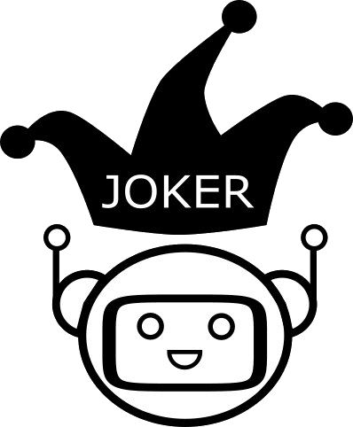

# JOKER

  



 
  <h1 align="center">CLEF 2026 JOKER Track:</h1>
  <h2 align="center">Humour Detection, Search, and Translation</h2>

------------------------------------------------------------

* [CLEF 2026 registration](https://clef2026.clef-initiative.eu/conference/registration/)
* [CLEF 2026 program](https://clef2026.clef-initiative.eu/conference/program/)
* [CLEF 2026 LNCS Proceedings](https://link.springer.com/book/9783032391490)
* [CLEF 2026 CEUR Working Notes](https://ceur-ws.org/Vol-4283/)
  
------------------------------------------------------------

JOKER Track sessions take place in **Room 131**, except for the plenary CLEF conference sessions in **Lecture Room 3**.

Remote participation links:
* Lecture Room 3: [Zoom Link](https://uni-jena-de.zoom-x.de/j/66385435727?pwd=it9CT09DNydV8Yw6OgHfj9UAAIiRbd.1)
* Lecture Room 131: [Zoom Link](https://uni-jena-de.zoom-x.de/j/69928669598?pwd=VVQjbMW8lT5oN79yt4XozYImwiXuGj.1)

## Monday 21st September 

* No track sessions.

## Tuesday 22nd September 

* No track sessions.

## Wednesday 23rd September 

### Lab Overviews 3 (Lecture Room 3)

* **11:15 - 12:05** <ins>Liana Ermakova</ins>, Igor Kuzmin, Poojan Vachharajani, Tristan Miller, Anne-Gwenn Bosser and Jaap Kamps, _Overview of the CLEF 2026 JOKER Track: Humor Detection, Search, and Translation_ in: Proceedings of CLEF'26, LNCS, Springer, 2026 (Paper, [Slides](slides/CLEF26_JOKER_Track_Overview.pdf), [DOI](https://doi.org/10.1007/978-3-032-39150-6_30)). 

## Thursday 24th September 

### Best of Labs, CLEF 2025 (Lecture Room 3)

* **10:20 - 10:30** <ins>Russell Taylor</ins>, Benjamin Herbert and Michael Sana, _Pun Intended: Multi-Agent Translation of Wordplay with Contrastive Learning and Phonetic-Semantic Embeddings_ in: Proceedings of CLEF'26, LNCS, Springer, 2026 (Paper, [Slides](slides/CLEF25_JOKER_BOTL_GT.pdf), [DOI](https://doi.org/10.1007/978-3-032-39150-6_20)). 

### JOKER Track Session 1/2 (Room 131)

* **11:00-12:00** CLEF 2026 JOKER Task Overviews:

* Poojan Vachharajani, Arjun Mukherjee, Jasvindar Singh, <ins>Krishna Tewari</ins>, Sukomal Pal, Jaap Kamps, Liana Ermakova 
_Overview of the CLEF 2026 JOKER Task 1: Humor-Aware Information Retrieval in English and Hinglish_, 4115-4128
([Paper](https://ceur-ws.org/Vol-4283/paper302.pdf), [Slides](slides/CLEF26_JOKER_Task_Overviews.pdf)).

* <ins>Liana Ermakova</ins>, Yael Naud, Lilian Binet, Baptiste Dumas, Jaap Kamps
_Overview of the CLEF 2026 JOKER Task 2: Pun Translation from English to French_, 4129-4143
([Paper](https://ceur-ws.org/Vol-4283/paper303.pdf), [Slides](slides/CLEF26_JOKER_Task_Overviews.pdf)).

* <ins>Liana Ermakova</ins>, Yael Naud, Lilian Binet, Jaap Kamps
_Overview of the CLEF 2026 JOKER Task 3: Onomastic Wordplay Translation from English to French_, 4144-4152
([Paper](https://ceur-ws.org/Vol-4283/paper304.pdf), [Slides](slides/CLEF26_JOKER_Task_Overviews.pdf)).

* <ins>Igor Kuzmin</ins>, Anne-Gwenn Bosser, Jaap Kamps, Liana Ermakova
_Overview of the CLEF 2026 JOKER Task 4: Humor Generation in English, French, and Spanish_, 4153-4178
([Paper](https://ceur-ws.org/Vol-4283/paper305.pdf), [Slides](slides/CLEF26_JOKER_Task4.pdf)).

* **12:00	–	12:30** CLEF 2026 JOKER Participant presentations:

* Jesse van Bakel, Robin Flier, <ins>Ezra Smink</ins>, Jan Bakker, Jaap Kamps
_University of Amsterdam at the CLEF 2026 JOKER Track_, 4290-4302
([Paper](https://ceur-ws.org/Vol-4283/paper315.pdf), [Slides](slides/CLEF26_JOKER_UvA.pdf)).

* <ins>Liana Ermakova</ins>, Yaël Naud, Lilian Binet, Baptiste Dumas
_Testing LLMs on JOKER Task 3: Onomastic Wordplay Translation and Task 4: Humour Generation. UBO at CLEF 2026_, 4220-4228
([Paper](https://ceur-ws.org/Vol-4283/paper309.pdf), [Slides](slides/CLEF26_JOKER_UBONLP.pdf)).

### JOKER Track Session 2/2 (Room 131)

* **14:00	–	15:00** CLEF 2026 JOKER Participant presentations:

* <ins>Ana-Maria Luisa Mocanu</ins>, Sebastian Mocanu, Ciprian-Octavian Truică, Elena-Simona Apostol
_IROH: Insightful Ranking Of Humor using Multi-Stage Hybrid Retrieval with Rationale-Distilled LLM Judges for JOKER 2026 Track Task 1 English_, 4229-4245
([Paper](https://ceur-ws.org/Vol-4283/paper310.pdf), [Slides](slides/CLEF26_JOKER_IROH.pdf)).

* Arjun Mukherjee, <ins>Krishna Tewari</ins>, Jasvindar Singh, Sukomal Pal
_From Words to Wit: Humor-Aware Information Retrieval in English and Hinglish_, 4246-4255
([Paper](https://ceur-ws.org/Vol-4283/paper311.pdf), [Slides](slides/CLEF26_JOKER_IREL.pdf)).

* <ins>Russell Taylor</ins>, Adam Brikman, Prateek Awate
_Searching for Sound-Meaning Collisions: Graph-Based Affordance Retrieval and Multi-Evaluator Ranking for Cross-Lingual Pun Translation at CLEF 2026 JOKER Task 2_, 4278-4289
([Paper](https://ceur-ws.org/Vol-4283/paper314.pdf), [Slides](slides/CLEF26_JOKER_GT.pdf)).

* <ins>Edward Ajayi</ins>, Prasenjit Mitra
_Cross-Lingual Cognitive Synergy for Constrained Humor Generation in LLMs: SaLT Lab at CLEF 2026 JOKER Track_, 4179-4194
([Paper](https://ceur-ws.org/Vol-4283/paper306.pdf), [Slides](slides/CLEF26_JOKER_CMUA.pdf)).

* (Time for additional talks, depending on demand, from the JOKER track.) 

* **15:00 - 15:30** CLEF 2027 JOKER Planning Session:
  
    * We want to hear from *you*!
    * What was great about JOKER 2026, and what could we improve for you?
      * Focus on humor generation?
      * Continue humor retrieval?
      * Interest in (onomastic) wordplay translation?   
    * Any ideas or volunteers are welcome!
    * JOKER roadmap ([Slides](slides/CLEF27_JOKER_Track.pdf)).

### Closing Ceremony and Introduction of CLEF 2027 

* **16:00	–	17:30** Closing and plans for 2027 (including slides on the CLEF 2027 JOKER track, [Slides](slides/CLEF27_JOKER_Track.pdf)).

------------------------------------------------------------

## All CLEF 2026 JOKER track papers 

### Including authors unable to present in person or online:

JOKER: Humor Detection, Search, and Translation

* Poojan Vachharajani, Arjun Mukherjee, Jasvindar Singh, Krishna Tewari, Sukomal Pal, Jaap Kamps, Liana Ermakova 
_Overview of the CLEF 2026 JOKER Task 1: Humor-Aware Information Retrieval in English and Hinglish_, 4115-4128
([Paper](https://ceur-ws.org/Vol-4283/paper302.pdf)).

* Liana Ermakova, Yael Naud, Lilian Binet, Baptiste Dumas, Jaap Kamps
_Overview of the CLEF 2026 JOKER Task 2: Pun Translation from English to French_, 4129-4143
([Paper](https://ceur-ws.org/Vol-4283/paper303.pdf)).

* Liana Ermakova, Yael Naud, Lilian Binet, Jaap Kamps
_Overview of the CLEF 2026 JOKER Task 3: Onomastic Wordplay Translation from English to French_, 4144-4152
([Paper](https://ceur-ws.org/Vol-4283/paper304.pdf)).

* Igor Kuzmin, Anne-Gwenn Bosser, Jaap Kamps, Liana Ermakova
_Overview of the CLEF 2026 JOKER Task 4: Humor Generation in English, French, and Spanish_, 4153-4178
([Paper](https://ceur-ws.org/Vol-4283/paper305.pdf)).

* Edward Ajayi, Prasenjit Mitra
_Cross-Lingual Cognitive Synergy for Constrained Humor Generation in LLMs: SaLT Lab at CLEF 2026 JOKER Track_, 4179-4194
([Paper](https://ceur-ws.org/Vol-4283/paper306.pdf)).

* Georgios Arampatzis, Avi Arampatzis
_DUTH at CLEF JOKER 2026: Conservative Hybridisation for Humor-Aware Retrieval, Pun Translation, Onomastic Wordplay Translation, and Multilingual Humour Generation_, 4195-4219
([Paper](https://ceur-ws.org/Vol-4283/paper307.pdf)).

* Fatimah Emad Eldin
_Cairo University at the CLEF 2026 JOKER Track Heuristic Pun-Morphology Features and Tree Ensembles for Humor-Aware Information Retrieval_, 
(No Paper).

* Liana Ermakova, Yaël Naud, Lilian Binet, Baptiste Dumas
_Testing LLMs on JOKER Task 3: Onomastic Wordplay Translation and Task 4: Humour Generation. UBO at CLEF 2026_,  4220-4228
([Paper](https://ceur-ws.org/Vol-4283/paper309.pdf)).

* Ana-Maria Luisa Mocanu, Sebastian Mocanu, Ciprian-Octavian Truică, Elena-Simona Apostol
_IROH: Insightful Ranking Of Humor using Multi-Stage Hybrid Retrieval with Rationale-Distilled LLM Judges for JOKER 2026 Track Task 1 English_, 4229-4245
([Paper](https://ceur-ws.org/Vol-4283/paper310.pdf)).

* Arjun Mukherjee, Krishna Tewari, Jasvindar Singh, Sukomal Pal
_From Words to Wit: Humor-Aware Information Retrieval in English and Hinglish_, 4246-4255
([Paper](https://ceur-ws.org/Vol-4283/paper311.pdf)).

* Ruslan Pylypiv, Maksym Kuznietsov, Martina Szabóová
_TUKE Satira at the CLEF 2026 JOKER Track: Constant-Variable Optimization for English-French Pun Translation_, 4256-4269
([Paper](https://ceur-ws.org/Vol-4283/paper312.pdf)).

* Xinrui Qiu, Huihui Chen, Jinghe Zhai
_CLEF 2026 JOKER Track: Relevance-Aware Multilingual Retrieval for Humorous Wordplay_, 4270-4277
([Paper](https://ceur-ws.org/Vol-4283/paper313.pdf)).

* Russell Taylor, Adam Brikman, Prateek Awate
_Searching for Sound-Meaning Collisions: Graph-Based Affordance Retrieval and Multi-Evaluator Ranking for Cross-Lingual Pun Translation at CLEF 2026 JOKER Task 2_, 4278-4289
([Paper](https://ceur-ws.org/Vol-4283/paper314.pdf)).

* Jesse van Bakel, Robin Flier, Ezra Smink, Jan Bakker, Jaap Kamps
_University of Amsterdam at the CLEF 2026 JOKER Track_, 4290-4302
([Paper](https://ceur-ws.org/Vol-4283/paper315.pdf)).

